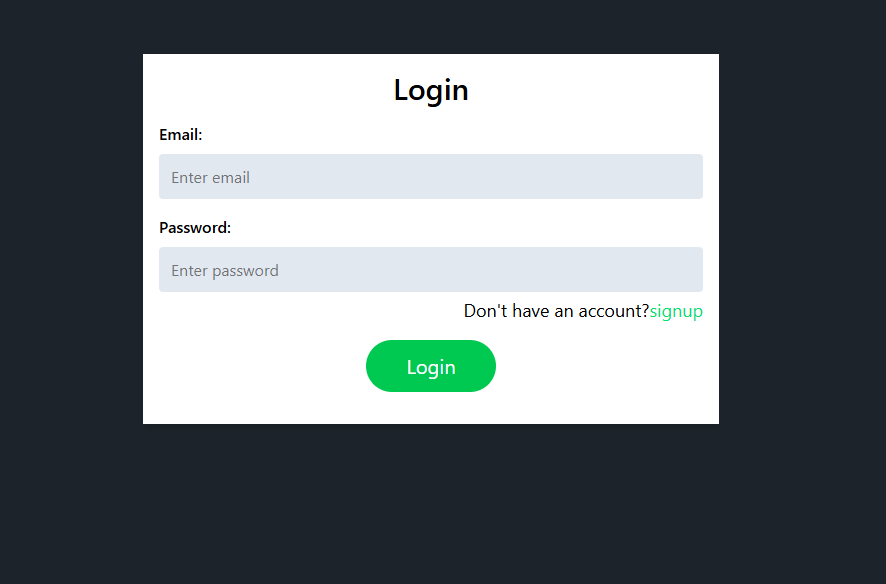
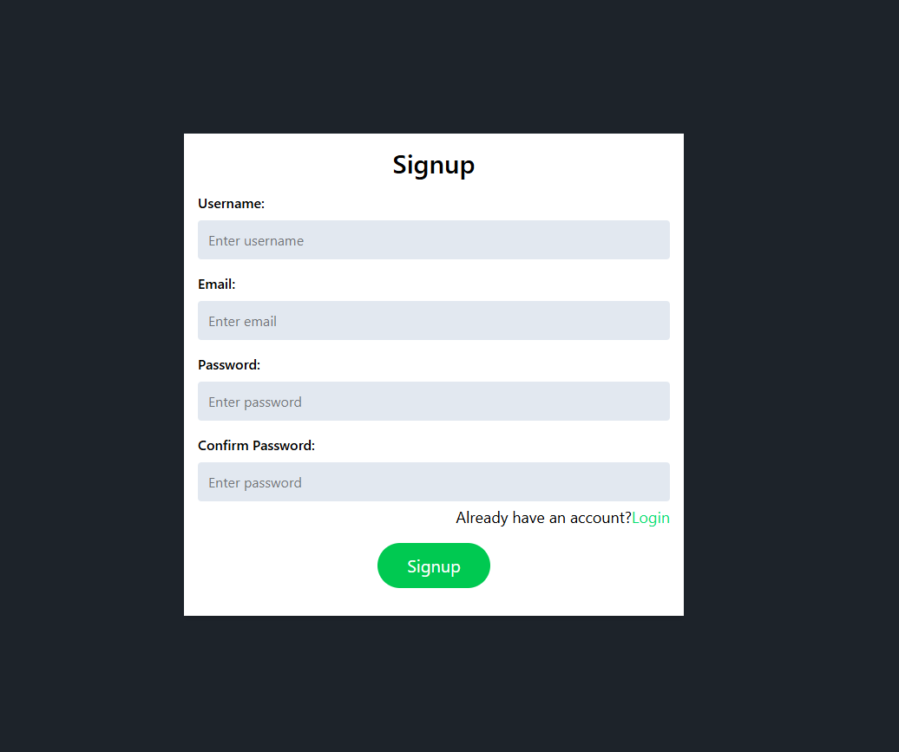
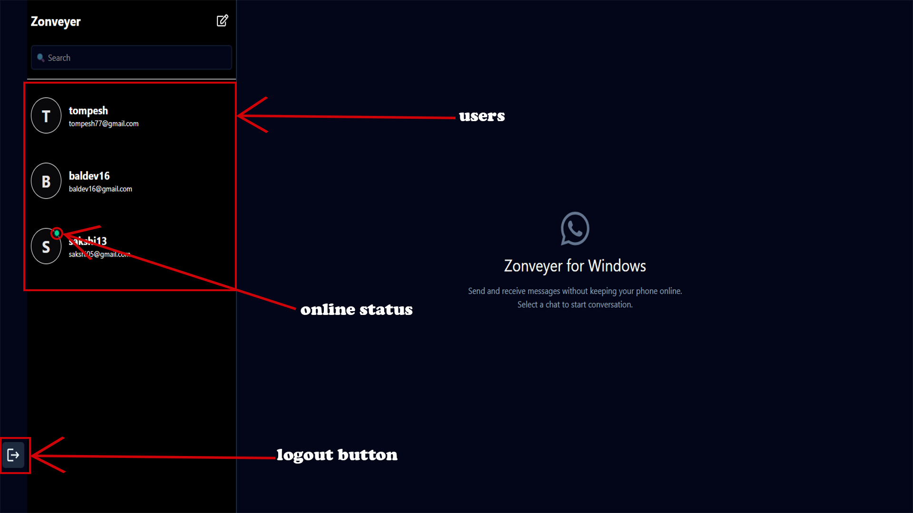
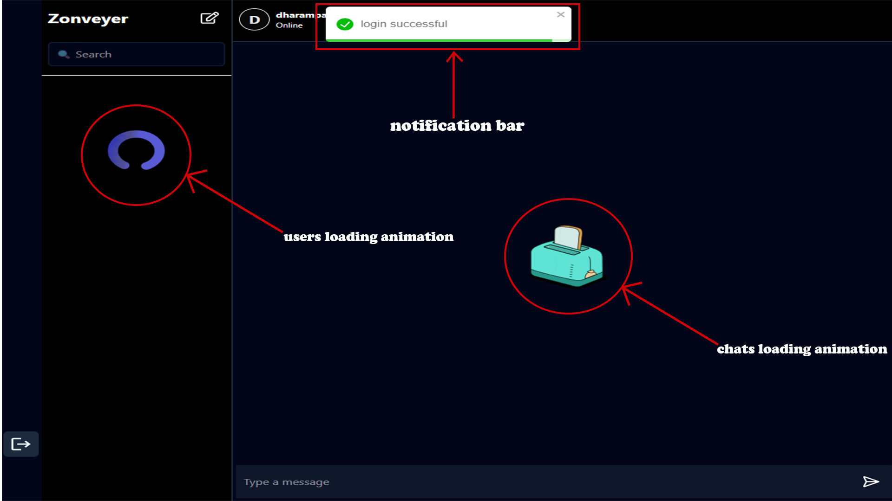
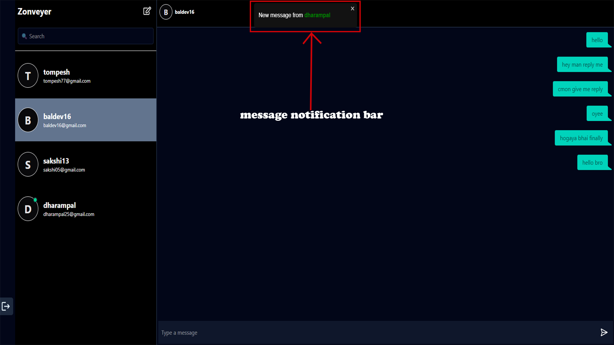
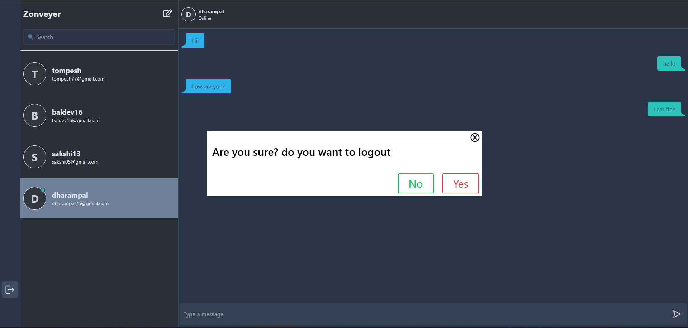
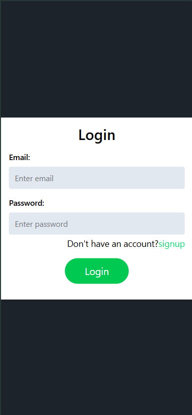
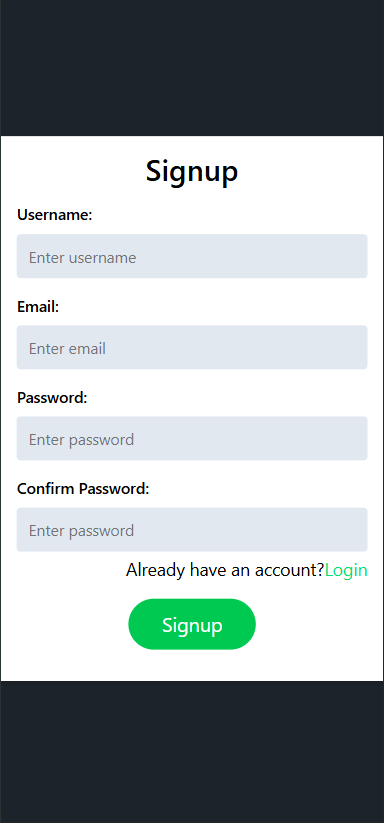
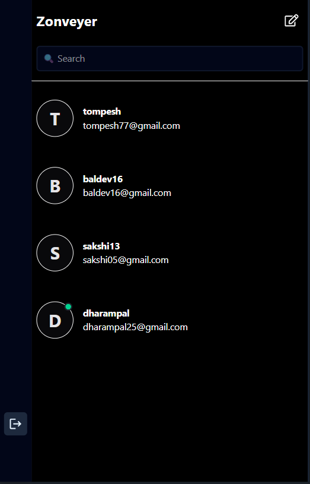
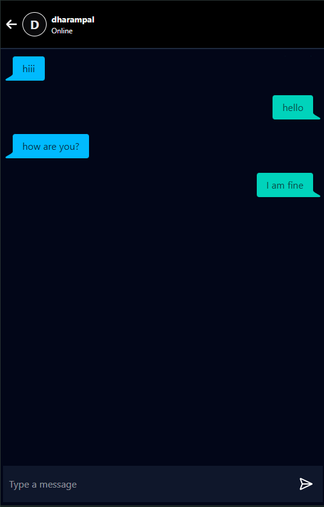

# 💬 Zonveyer — Real-Time Chat App

Zonveyer is a **responsive real-time chat application** built with the **MERN stack**. It supports **instant messaging**, **authentication with protected routes**, and **real-time updates via WebSocket**. The frontend uses **DaisyUI** for UI components and **Zustand** for lightweight state management.

---

## 🖼️ Screenshots

### 📱 Authentication Flow

#### 🔐 Login Page


#### 📝 Signup Page


---

### 🧭 Main Application

#### 🏠 Home Page (Desktop)


#### 👤 Users, Chats Loading State and Notification Bar


#### 💭 Message Notification


#### 🔓 Logout Confirmation


---

### 📱 Mobile View

#### 📲 Mobile Login Page


#### 🧾 Mobile Signup Page


#### 🏠 Mobile Home Page


#### 💬 Mobile Chat Page


---


## 📁 Project Structure

```plaintext
linkon/
├── frontend/                     # React app for user interface
├── backend/                      # Express API server
```


## 🛠️ Tech Stack

### Frontend
- **React.js**
- **Tailwind CSS** + **DaisyUI**
- **Zustand** (State Management)
- **Socket.IO Client** (WebSocket communication)
- **Fetch** for HTTP requests
- **React Router DOM** for routing and protection

### Backend
- **Node.js**
- **Express.js**
- **MongoDB** (with Mongoose)
- **Socket.IO** (WebSocket server)
- **JWT** for auth and route protection

---

## 🚀 Features

- ✅ **Real-time messaging** via WebSocket (Socket.IO)
- 🔐 **Protected routes** with token-based auth
- 🧠 **Zustand** for simple and fast global state management
- 🎨 **Responsive UI** using **DaisyUI**
- 🧵 **Conversation threads** with message history
- 📲 Mobile-friendly view (Left pane collapses on small screens)
- 🔔 Toast notifications for new messages and alerts
- 🕒 Sorts users based on latest conversation/message
- ⚠️ Notifications for incoming messages from other users even when chat is not open

---

## 📷 Screenshots

<!-- Add screenshots here if available -->
_coming soon..._

---


## 📦 Installation & Setup

### 1. Clone the repo

```bash
git clone https://github.com/Shettysahil16/zonveyer.git
cd zonveyer
```

### 2. Setup backend

```bash
cd backend
npm install
```
### 3. Create a .env file in backend with the following:

```bash
FRONTEND_URI = your_frontend_url
MONGO_URI=your_mongo_connection_string
JWT_SECRET=your_jwt_secret
```
### 4. Start the backend server:

```bash
nodemon
```

### 5. Setup frontend

```bash
cd ../frontend
npm install
```

### 6. Create a .env file:

```bash
VITE_BACKEND_URI = your_backend_url
```

### 7. Start the frontend dev server:

```bash
npm run dev
```


